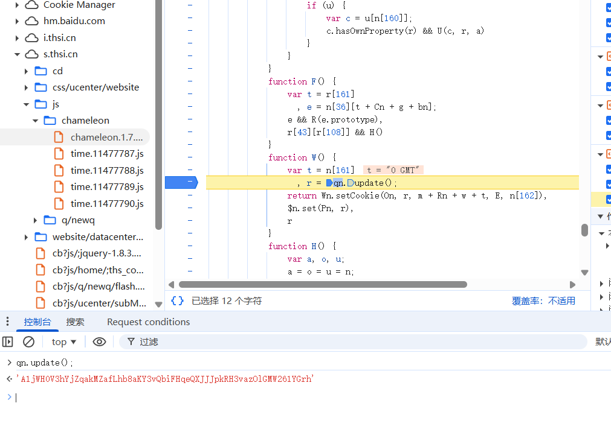
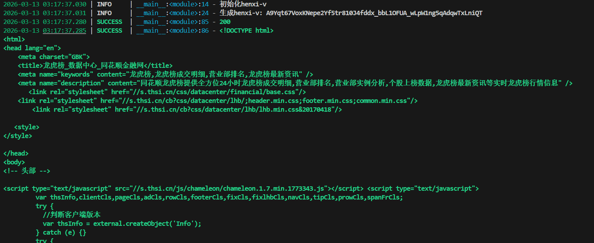

# hexin-v-v 参数逆向分析笔记

## 初步定位思路

- 怀疑使用了**自定义异或算法**，包含浏览器环境、指纹等信息
- 全局搜索 `hexin-v` 无明显结果 → 高度疑似**代码混淆**
- 发现 `hexin-v` 参数与 Cookie 中的 `v` 参数**内容完全相同**
- 策略：全局搜索 `setCookie` / `document.cookie` → 下断点
- 刷新页面后断点命中，发现调用链最终指向 `qn.updata()` 返回值

继续跟栈追溯，发现核心生成逻辑位于 `function R() {}` 内部  
→ 整体是一个**立即执行的大函数**，且经过**较重的混淆**

## 解混淆流程

1. 使用 **acorn** 解析生成 AST
2. 遍历 AST 节点，依次处理以下转换：
   - 合并拆分字符串
   - 替换变量名 → 数组索引访问
   - 展开立即执行函数 / 冗余函数包装
   - 部分常量折叠
3. 输出可读性较高的代码后，再进行具体算法分析

## 算法核心组成

Hexin-v 的核心是一个**固定 18 个字段**的结构体（类名为 `Un`），主要特点如下：

### 1. 核心数据结构（Un 类）

| 字段类型       | 内容示例                     | 字节长度 | 说明                     |
|----------------|------------------------------|----------|--------------------------|
| UA 相关        | User-Agent 哈希 / 部分特征   | 变长     | 浏览器标识               |
| 鼠标事件序列   | click / mousemove 等轨迹摘要 | 固定/变长| 行为指纹                 |
| 环境检测       | WebGL、Canvas、字体等        | 固定     | 浏览器环境完整性         |
| ……             | ……                           | ……       | 共 **18** 个字段         |

最终序列化后固定为 **44 字节** 数据体。

### 2. 序列化与加密流程

1. **序列化**  
   `Un.toBuffer()` → 大端序 → 得到 **44 字节** 数据

2. **加密 & 打包**  
   - 计算 44 字节数据的 **校验和**
   - 构造前缀：`[3, 校验和]`（固定魔数 3 + 1 字节校验）
   - 拼接：`[3, 校验和] + 44字节数据` → 共 **46 字节**

3. **异或加密**  
   密钥 = 上一步计算的**校验和**（1 字节）  
   对整个 46 字节进行**逐字节异或**

4. **最终编码**  
   对加密后的 46 字节做 **Base64** 编码  
   → 输出长度固定为 **60 字符** 的字符串

### 算法评价

- 加密强度：**极低**（单字节密钥 + 简单异或）
- 环境检测点：**较少**，容易通过补环境绕过
- 主要逆向难点：**代码混淆**（变量名、控制流、字符串拆分等）
- 建议逆向顺序：**先补全常见浏览器环境 → 再分析纯算法逻辑**

