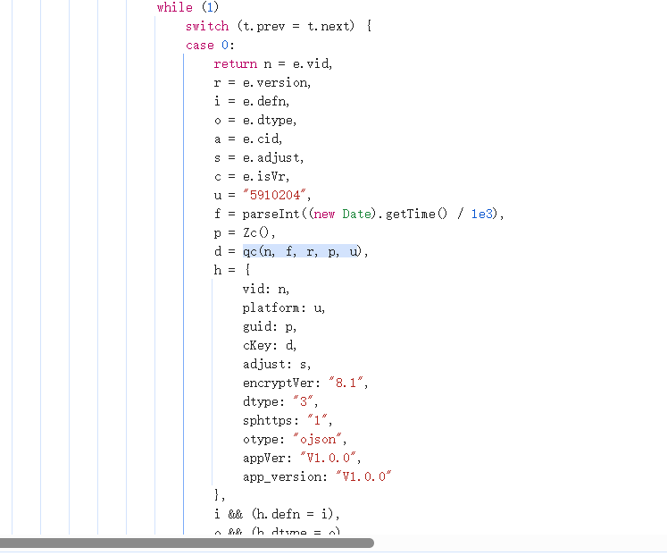
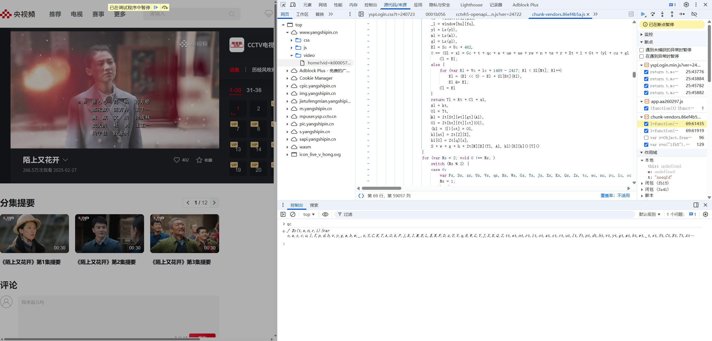
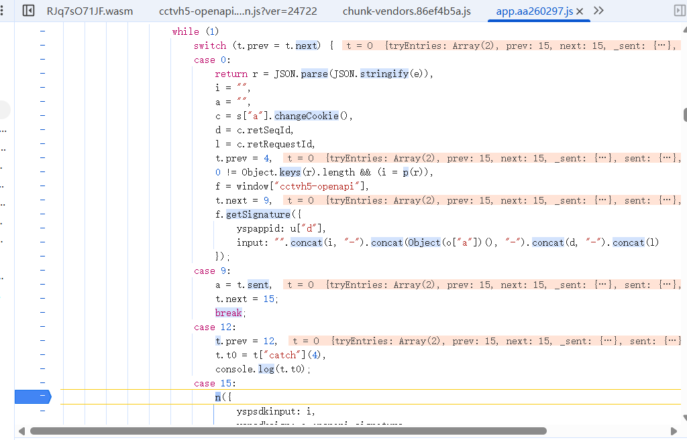
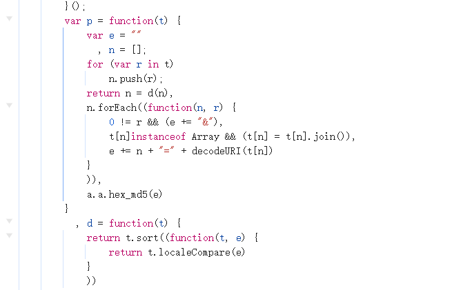
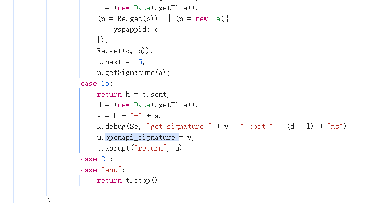
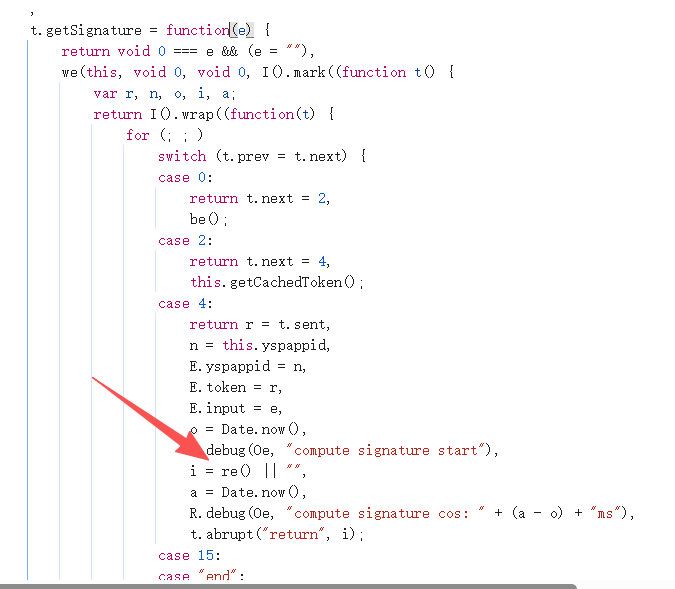
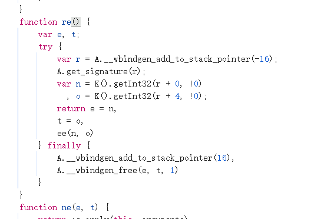
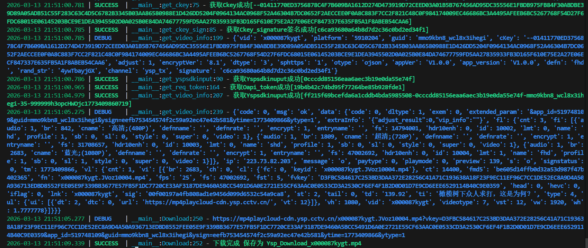

# 央视频 vkey

## 目标
通过算法协议全自动下载视频。

### cKey 和 signature
观察到下载链接中包含 vkey、ysign 等加密参数。初步浏览器搜索并未发现相关参数，怀疑是加密了参数名或其他接口返回。

搜索后确定是由 `get_video_info` 接口返回。观察接口，内含诸多参数，初步分析如下：
- `vid`：视频 ID
- `platform`：设备相关
- `guid`：设备相关
- 其他均为基本固定值

需要逆向的参数：`cKey`、`signature`。

搜索 `cKey`：找到赋值接口。



发现 `cKey` 是由 `qc` 函数返回，并传了五参；`signature` 是由 `Ru(v({}, h))` 返回。

进入 `qc` 函数，发现是经过了混淆的函数。无妨，直接看 return 部分，由固定部分 `S + w + g + h` 即 `--01` 加上标准 AES 加密部分完成。此部分非常简单，下断点看加密内容即可。加密内容、加密 key、iv 都可直接 hook 得到。此处不点明，需要注意的是第一部分参数是自定义 int32 哈希，整体是 `'--01' + aes 加密`。



随后分析 `Ru` 函数：`Ru` 是经典的字符串排列 sign 组合，需要注意的是在后面加上了 salt，即 `du`，hook 即可得到。

拿到所有参数后，继续请求。

## yspsdkinput
请求后发现失败，观察到请求头存在疑似加密参 `yspsdkinput`。搜索后一路下断点跟栈。

进入到函数内部，发现 `i` 值即 `yspsdkinput` 由 `p(r)` 生成。`p` 函数是类似于 signature 函数的加密方式。





## yspsdksign
还是失败，注意到请求头还有个参数名为 `yspsdksign`。



进一步搜索，发现由 `h-{yspsdkinput}-{GUID}-{seq_id}-{request_id}` 组成。

重点是 `h` 参。

观察发现 `h` 参是 `p.getSignature(a);` 里面异步生成的。再进一步由 `Re()` 异步生成，且在生成之前调用了 `Be()` 函数。



`Re` 函数如下：



结合 `Be` 函数，判断此加密在 WASM 里面完成。WASM 是一种在浏览器中运行的高性能、低级类汇编语言。常见的用法是把下面这些语言编译成 `.wasm` 文件，然后在浏览器里跑：
- C / C++
- Rust
- Go

分析整个流程不难发现，整个流程是由 `Be` 函数初始化 WASM，随后通过调用 `var r = A.__wbindgen_add_to_stack_pointer(-16);` 在栈上分配空间。

随后通过 `A.get_signature(r);` 传入指针加密数据。

再调用 `ee(n, o);` 把数据从栈上读取出来并转为字符串。

那么重点就是放在 `A.get_signature(r);` 里，而且可以肯定的是，在加密时并没有传入待加密的数据。那么除此之外唯一的可能性就是由 WASM 文件从浏览器全局环境里读取需要的数据，例如 `window`、`document` 等。

所以此处是不能尝试直接把 WASM 扣下来调用的，太麻烦了。较好的选择是进入 WASM 分析一下 sign 是怎么组成的。

1. 不难看出此 WASM 是由 Rust 构造。函数开头分配 176 字节空间：
   ```wasm
   global.get $global0
   i32.const 176
   i32.sub
   local.tee $var1
   global.set $global0
   ```

2. WASM 不是直接拿字符串，而是：JS object -> wasm-bindgen -> memory
   ```wasm
   call $wbg.__wbg_get_9c1840f7ecd81363
   call $wbg.__wbindgen_string_get
   ```
   - 1️⃣ 从 JS 对象取属性
   - 2️⃣ 转成 WASM 字符串

   在 data 段可以看到：读取了
   - `cctvh5openapi.state.guid`
   - `cctvh5openapi.state.yspappid`
   - `cctvh5openapi.state.input`

3. 构造了 buffer：
   ```wasm
   call $func22 // copy static string 到 buffer
   call $func16
   call $func51
   ```

4. 观察到大量 MD5 常量，这些正是 MD5 四轮算法：
   ```wasm
   i32.rotl
   i32.xor
   i32.and
   i32.add
   ```

   确认算法是 MD5。

   流程上是：
   - JS 调用 ↓
   - `get_signature(ptr)`
     1. 分配 stack frame
     2. 从 JS object 读取字段
     3. 判断 version == "v0"
     4. 构造字符串 buffer
     5. MD5(buffer)
     6. 转 hex
     7. 返回 sign

至此分析完成。

## 算法评价

- 加密强度：**极低**（
- 环境检测点：**较少**，容易通过补环境绕过
- 主要逆向难点：**wasm** | `yspsdksign` 需要用到 WASM 逆向相关知识，WASM 由 Rust 构造，逻辑较为清晰，不要再使用 IDA 等逆向。其他全是送分题，难度基本为 0。
- 总强度 ***5/10***



